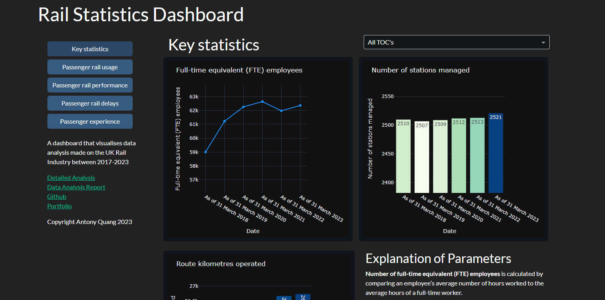

# Allergy Menu Map
https://antonyquang.pythonanywhere.com/

Data analysis project that explores the UK rail industry and how it has been impacted by COVID-19.

# Repository Description:



This is a data analysis project that uses Python, pandas and numpy to explore data related to the UK rail industry.
The results and process of the data analysis has been explored in three different ways:

1. [A dashboard using plotly and Dash](https://antonyquang.pythonanywhere.com/)
2. [A Google Colab Notebook](https://colab.research.google.com/drive/19ygzlsQqY0q2sYEHoKQsQTmWNLHB_qQn?usp=sharing)
3. [A final report write-up](https://github.com/AntonyQuang/Rail-Statistics-Dashboard/blob/main/Analysing%20Train%20Operating%20Company%20Data%20in%20the%20UK%20Railway%20Industry.pdf)

# Project Organization:

The project consists of the following directories and files:

```
├── assets/ 
├── data/ 
│   ├── 2200_key_statistics_by_operator.ods
│   └── table-2200_key_statistics_by_operator_2.ods
├── Analysing Train Operating Company Data in the UK Railway Industry.pdf
├── app.py
├── data_manager.py
├── graph_manager.py
├── Rail Industry Statistics.ipynb
└── requirements.txt
```

assets/: Contains visualisation files for the dashboard, including icons and styling.

data/: Contains data sources for data analysis.

Analysing Train Operating Company Data in the UK Railway Industry.pdf: Detailed Data Analysis Report.

app.py: Application to run the Rail Statistics Dashboard.

data_manager.py: Code that extracts and manipulates the data for data analysis.

graph_manager.py: Code the visualises the data.

Rail Industry Statistics.ipynb: Google Colab notebook used for data analysis. 

requirements.txt: Lists the required packages and dependencies for the application.

# License Information:

This project is licensed under the MIT License (opensource.org/licenses/MIT).

# Status and Roadmap

The application is currently in a functional state, but there is still room for improvement and new features to be added. The project roadmap includes transferring the database to a PostgreSQL database format, improving the website scalability, and integrating email functions.
